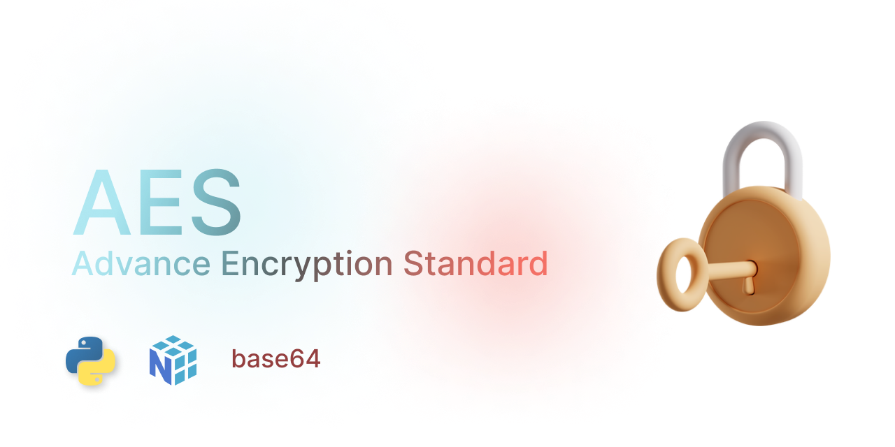
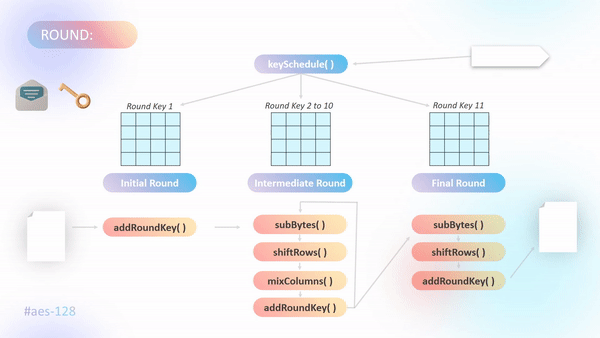
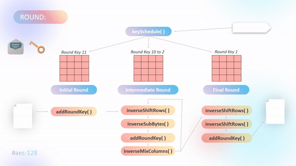
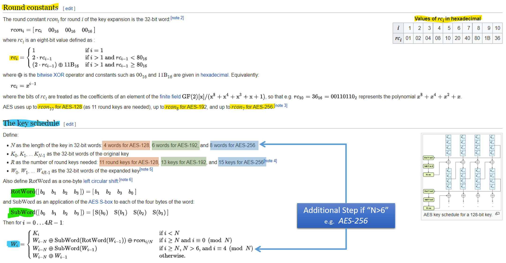
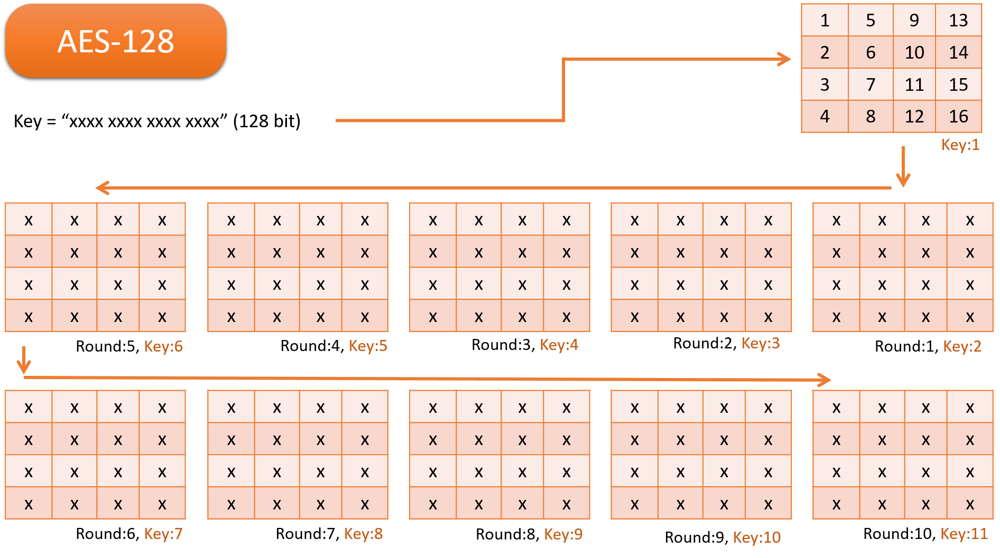
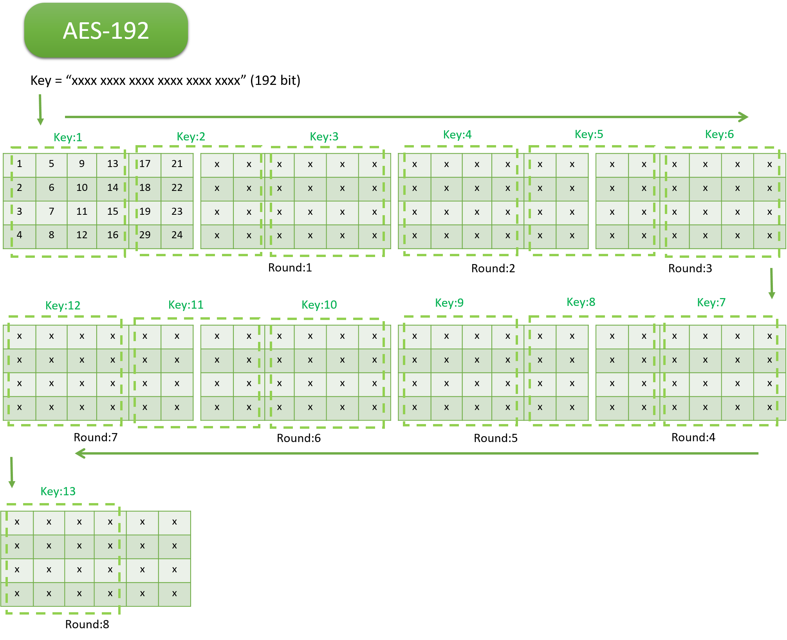
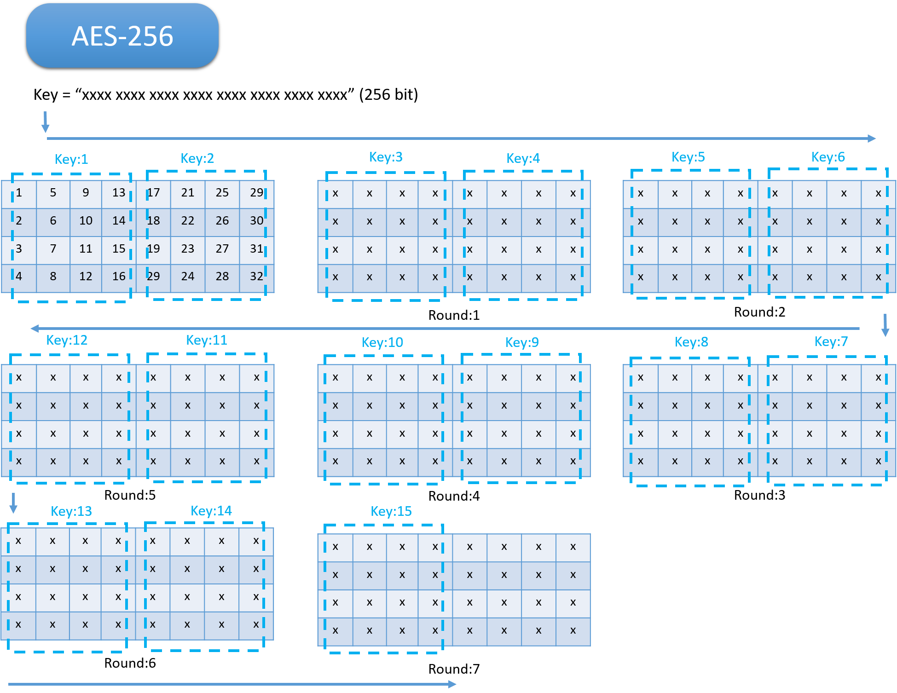

<p align="center">
	<a href="version">
		
	</a>
    <a href="link to license">
		
	</a>
	<a href="link to license">
		
	</a>
    <a href="LICENCE"> 
		
	</a>
</p>

<br/>

# Advance Encryption Standard


### AES-128 Encryption



### AES-128 Decryption



<br/>

### Key Schedule

```py
# ROUNDKEY := []
# hexKey := keyToHexArray(KEY)
# ROUNDKEY.append(hexKey)
# LOOP => 1 to ORDER
    # arr := Fetch last array of roundkey
    # xc := last row of arr
    # sc := shift row / ROTWORD 
    # s-box-row := S_box(sc)
    # a := XOR row-1,s-box-row,rcon-1
    # b := XOR a,row-2
    # c := XOR b,row-3
    # d := XOR c,row-4
    # x := matrix [a,b,c,d]
    # append x to ROUNDKEY
```

### Example
Round Key: [Detailed Example](https://www.kavaliro.com/wp-content/uploads/2014/03/AES.pdf).

Key: 'Thats my Kung Fu' => hex(54 68 61 74 73 20 6D 79 20 4B 75 6E 67 20 46 75)
- `Round 0:` 54 68 61 74 73 20 6D 79 20 4B 75 6E 67 20 46 75
- `Round 1:` E2 32 FC F1 91 12 91 88 B1 59 E4 E6 D6 79 A2 93
- `Round 2:` 56 08 20 07 C7 1A B1 8F 76 43 55 69 A0 3A F7 FA
- `Round 3:` D2 60 0D E7 15 7A BC 68 63 39 E9 01 C3 03 1E FB
- `Round 4:` A1 12 02 C9 B4 68 BE A1 D7 51 57 A0 14 52 49 5B
- `Round 5:` B1 29 3B 33 05 41 85 92 D2 10 D2 32 C6 42 9B 69
- `Round 6:` BD 3D C2 B7 B8 7C 47 15 6A 6C 95 27 AC 2E 0E 4E
- `Round 7:` CC 96 ED 16 74 EA AA 03 1E 86 3F 24 B2 A8 31 6A
- `Round 8:` 8E 51 EF 21 FA BB 45 22 E4 3D 7A 06 56 95 4B 6C
- `Round 9:` BF E2 BF 90 45 59 FA B2 A1 64 80 B4 F7 F1 CB D8
- `Round 10:` 28 FD DE F8 6D A4 24 4A CC C0 A4 FE 3B 31 6F 26



Key Schedule: [Wikipedia](https://en.wikipedia.org/wiki/AES_key_schedule)

<br/>
<br/>

# `Rounds` & `Keys`





<br/>
<br/>

# Encryption Process

```py
# cipher_arr := []

# Round 0
    # data_arr := dataToHexArray(data)
    # cipher_arr := XOR(data_arr, ROUNDKEY[0])

# Round [i] from 1 to 10
    # arr := prev_arr
    # arr := sBox(arr)
    # arr := shiftRow(arr)
    # arr := mixColumn(arr)     <<Skip for last round>>
    # key_arr := ROUNDKEY[i]
    # xor_arr := XOR(data_arr, key_arr)

# return cipher_arr
```

# Decryption Process

```py
# plain_arr := []

# Round 0
    # data_arr := dataToHexArray(data)
    # plain_arr := XOR(data_arr, ROUNDKEY[0])

# Round [i] from 1 to 10
    # arr := prev_arr
    # arr := shiftRow(arr)
    # arr := sBox(arr)
    # key_arr := ROUNDKEY[10-i]
    # xor_arr := XOR(data_arr, key_arr)
    # arr := mixColumn(arr)     <<Skip for last round>>

# return plain_arr
```


# Using AES-128/192/256

`index.py`

```py
from aes128 import AES as AES_128
from aes192 import AES as AES_192
from aes256 import AES as AES_256
from aes512 import AES as AES_512


msg = 'Checking AES Encryption & Decryption on python'
encode = '__all__'


print('AES 128')
key = 'Thats my Kung Fu'    # 16 character / 128 bits
encrypt_128 = AES_128()
x = encrypt_128.encrypt(key, msg, encode)
y = encrypt_128.decrypt(key, x['hex'])
print(x)
print(y, end='\n\n')


print('AES 192')
key = 'Thats my Kung Fu Panda !'    # 24 character / 192 bits
encrypt_192 = AES_192()
x = encrypt_192.encrypt(key, msg, encode)
y = encrypt_192.decrypt(key, x['hex'])
print(x)
print(y, end='\n\n')


print('AES 256')
key = 'Thats my Kung Fu Panda ! Style12'    # 32 character / 256 bits
encrypt_256 = AES_256()
x = encrypt_256.encrypt(key, msg, encode)
y = encrypt_256.decrypt(key, x['hex'])
print(x)
print(y, end='\n\n')


print('AES 512')
key = 'Thats my Kung Fu Panda ! Style12Thats my Kung Fu Panda ! Style12'    # 64 character / 512 bits
encrypt_512 = AES_512()
x = encrypt_512.encrypt(key, msg, encode)
y = encrypt_512.decrypt(key, x['hex'])
print(x)
print(y, end='\n\n')
```

`Create Virtual Environment`

```cmd
py -m venv venv-aes
```

`Activate Virtual Environment`

```cmd
source venv-aes/Scripts/activate
```

`Install Dependencies`

```cmd
pip install -r requirements.txt
```

`Run`

```cmd
py index.py
```

`Output`

```json
AES 128
{
    "hex": "aa04ae93ef2ccaa610b90f96074941601545f82d2e7a4d3dffeb97749d81108b3c104e9459ef5d0671cd97122d972bd0", 
    "b64": "qgSuk+8syqYQuQ+WB0lBYBVF+C0uek09/+uXdJ2BEIs8EE6UWe9dBnHNlxItlyvQ", 
    "0b": "101010100000010010101110100100111110111100101100110010101010011000010000101110010000111110010110000001110100100101000001011000000001010101000101111110000010110100101110011110100100110100111101111111111110101110010111011101001001110110000001000100001000101100111100000100000100111010010100010110011110111101011101000001100111000111001101100101110001001000101101100101110010101111010000"
}
Checking AES Encryption & Decryption on python

AES 192
{
    "hex": "dc999a4e37270708591d464de88e0c1702bcb5b4008a76ec8e9d023bc9ef67559801ad1a6ca936788a6b14d6c37baf1a", 
    "b64": "3JmaTjcnBwhZHUZN6I4MFwK8tbQAinbsjp0CO8nvZ1WYAa0abKk2eIprFNbDe68a", 
    "0b": "110111001001100110011010010011100011011100100111000001110000100001011001000111010100011001001101111010001000111000001100000101110000001010111100101101011011010000000000100010100111011011101100100011101001110100000010001110111100100111101111011001110101010110011000000000011010110100011010011011001010100100110110011110001000101001101011000101001101011011000011011110111010111100011010"
}
Checking AES Encryption & Decryption on python

AES 256
{
    "hex": "47719d9f4b4dc13c5647ef0962846a86f29942ac04b036d7385711a924aa1028e3d3b3cedccb8836cb1344ca80613f16", 
    "b64": "R3Gdn0tNwTxWR+8JYoRqhvKZQqwEsDbXOFcRqSSqECjj07PO3MuINssTRMqAYT8W", 
    "0b": "010001110111000110011101100111110100101101001101110000010011110001010110010001111110111100001001011000101000010001101010100001101111001010011001010000101010110000000100101100000011011011010111001110000101011100010001101010010010010010101010000100000010100011100011110100111011001111001110110111001100101110001000001101101100101100010011010001001100101010000000011000010011111100010110"
}
Checking AES Encryption & Decryption on python

AES 512
{
    "hex": "4972a7a011927bab546820136529c8add65a5bb4e860172dccf0e828e631b3f77d73bf42ab9dbeff65f9c9e6ff7d24e720b6ae9cc8ea333f78d02a67f5a42b88", 
    "b64": "SXKnoBGSe6tUaCATZSnIrdZaW7ToYBctzPDoKOYxs/d9c79Cq52+/2X5yeb/fSTnILaunMjqMz940Cpn9aQriA==", 
    "0b": "01001001011100101010011110100000000100011001001001111011101010110101010001101000001000000001001101100101001010011100100010101101110101100101101001011011101101001110100001100000000101110010110111001100111100001110100000101000111001100011000110110011111101110111110101110011101111110100001010101011100111011011111011111111011001011111100111001001111001101111111101111101001001001110011100100000101101101010111010011100110010001110101000110011001111110111100011010000001010100110011111110101101001000010101110001000"
}
Checking AES Encryption & Decryption on python
```

<br/>
<br/>

# AES-512 `Testing`

Instead of traditional 4\*4 matrix it uses 8\*8 matrix with
- Key Length = `512b` / `64B`
- Rounds = 11 (initial + 9 intermediate + 1 final)